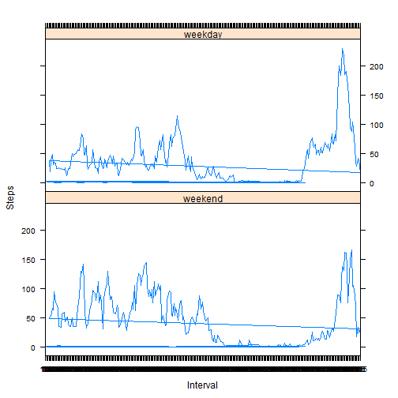

# Reproducible Research: Peer Assessment 1


## Loading and preprocessing the data
*Place the data file archive in a folder called ' data ' under the current directory*

```r
classes = c("integer", "Date", "integer")
activity.df <- read.csv(unz("data/repdata_data_activity.zip", filename = "activity.csv"), 
    colClasses = classes)
activity.complete.df <- na.omit(activity.df)
```


## What is mean total number of steps taken per day?


```r
x <- with(activity.complete.df, tapply(steps, as.factor(date), sum))
hist(x, breaks = 10, col = "yellow")
```

 

Mean number of steps taken per day : 1.0766 &times; 10<sup>4</sup>  
   
Median of steps taken per day : 10765


## What is the average daily activity pattern?


```r
intv <- as.factor(activity.complete.df[, "interval"])
intv.mean <- tapply(activity.complete.df[, "steps"], intv, mean)
plot(x = unique(intv), y = intv.mean, type = "l", cex = 2)
```

 


Interval with the highest average number of steps : 835

## Imputing missing values
Total number of missing values in the dataset = 2304

Replace missing value for a given interval on a certain date with the mean value of steps for that interval across all states

```r
for (i in 1:nrow(activity.df)) {
    if (is.na(activity.df[i, "steps"])) 
        activity.df[i, "steps"] <- intv.mean[as.character(activity.df[i, "interval"])]
}
x <- with(activity.df, tapply(steps, as.factor(date), sum))
hist(x, breaks = 10, col = "yellow")
```

 

Mean number of steps taken per day : 1.0766 &times; 10<sup>4</sup>  
   
Median of steps taken per day : 1.0766 &times; 10<sup>4</sup>


## Are there differences in activity patterns between weekdays and weekends?

```r

daytype <- function(date.in) {
    
    err.date.handler <- function(expr) stop(paste(expr, " not a valid 'date' "), 
        call. = F)
    
    day <- tryCatch(weekdays(as.Date(date.in), abbreviate = T), error = function(e) err.date.handler(date.in))
    if (day == "Sat" | day == "Sun") 
        return("weekend") else return("weekday")
    
}

activity.df <- cbind(activity.df, datetype = sapply(activity.df[, "date"], daytype))
l <- split(activity.df, activity.df[, "datetype"])

# Calculate weekday average of steps
weekday.mean <- tapply(l[["weekday"]][, "steps"], as.factor(l[["weekday"]][, 
    "interval"]), mean)
# Calculate weekend average of steps
weekend.mean <- tapply(l[["weekend"]][, "steps"], as.factor(l[["weekend"]][, 
    "interval"]), mean)

u <- data.frame(interval = rownames(weekend.mean), mean.steps = as.vector(weekend.mean), 
    datetype = "weekend")
v <- data.frame(interval = rownames(weekday.mean), mean.steps = as.vector(weekday.mean), 
    datetype = "weekday")
alldays.df <- rbind(u, v)


library(lattice)

xyplot(mean.steps ~ interval | datetype, data = alldays.df, layout = c(1, 2), 
    type = "l", xlab = "Interval", ylab = "Steps")
```

 

